# Copilot Ralph Loop

A language-agnostic implementation of the Ralph Wiggum autonomous agent loop for VSCode, using custom agents with automatic handoffs.

## What is Ralph Loop?

**Ralph loop = Fresh context + Filesystem memory**

An autonomous coding pattern where:
1. Agent picks a task from PRD
2. Executes it with fresh context
3. Commits and updates progress
4. Loops until all tasks complete

Named after Ralph Wiggum from The Simpsons - persistent iteration beats one-shot perfection.

## Architecture

```mermaid
flowchart TD
    Human["👤 Human\nCreates requirements"] --> Planner["🗂️ Planner\nAgent"]
    Planner -->|"Generates"| PRD["📄 PRD.md"]

    PRD --> Coordinator["🎯 Coordinator\nAgent 1"]
    Coordinator <-->|"Handoff"| Executor["⚙️ Executor\nAgent 2"]

    Coordinator -->|"Reads / Writes"| Progress["📊 PROGRESS.md\nFilesystem Memory"]
    Executor -->|"Reads / Writes"| Progress

    Executor -->|"Commits"| Git["🗃️ Git History"]

    style Human fill:#f0f0f0,stroke:#666
    style PRD fill:#fff3cd,stroke:#856404
    style Progress fill:#d1ecf1,stroke:#0c5460
    style Git fill:#d4edda,stroke:#155724
    style Planner fill:#cce5ff,stroke:#004085
    style Coordinator fill:#e2d9f3,stroke:#4a0072
    style Executor fill:#fce8e8,stroke:#721c24
```



### Execution Flow

```mermaid
sequenceDiagram
    participant H as 👤 Human
    participant P as Planner
    participant C as Coordinator
    participant E as Executor
    participant FS as 📁 Filesystem

    H->>P: Requirements
    P->>FS: Write PRD.md + PROGRESS.md
    P-->>H: Handoff: Start Ralph Loop

    H->>C: Start loop

    loop Until all tasks complete
        C->>FS: Read PRD.md + PROGRESS.md
        C->>E: Spawn subagent (task + criteria)
        E->>FS: Read PRD.md + PROGRESS.md
        E->>E: Implement task
        E->>FS: Update PROGRESS.md
        E->>FS: git commit
        E-->>C: Completion summary
    end

    C->>C: All tasks done
    C-->>H: COMPLETE
```



## Features

✅ **Automatic handoffs** - Agents pass control automatically
✅ **Progress file** - Fresh context every iteration via PROGRESS.md
✅ **Language agnostic** - Works with any programming language/stack
✅ **Atomic tasks** - One task per iteration, committed immediately
✅ **Context reset** - Avoids context pollution, uses filesystem as memory
✅ **Built-in review** - Reviewer subagent verifies every task before moving on

## Setup

### Prerequisites

- VSCode 1.106+ (custom agents support)
- Git repository initialized in your project
- VSCode Copilot or compatible AI extension

### Installation

1. Copy agent files to your project:

```bash
mkdir -p .github/agents
cp agents/*.agent.md .github/agents/
```

2. Restart VSCode or reload window

3. Verify agents are available:
   - Open Command Palette (`Cmd+Shift+P` / `Ctrl+Shift+P`)
   - Type "Select Agent"
   - Should see: Coordinator, Executor, Planner
   - (Reviewer is `user-invokable: false` — it won't appear in the dropdown, only used as a subagent)

## Usage

### Quick Start

1. **Create PRD** with Planner agent:
   ```
   Open VSCode Chat
   Select: Planner agent
   Prompt: "Create a PRD for [your feature]"
   ```

2. **Review PRD.md** - Edit as needed

3. **Start Loop** with Coordinator:
   ```
   Select: Coordinator agent
   Click: "Start Ralph Loop" handoff button
   ```

4. **Let it run** - Agents will:
   - Pick tasks from PRD.md
   - Execute them
   - Update PROGRESS.md
   - Commit changes
   - Repeat until done

5. **Monitor progress**:
   ```bash
   cat PROGRESS.md
   git log --oneline -10
   ```

### Manual Iteration (Human-in-the-Loop)

For controlled execution:

1. Coordinator selects task
2. Click "Execute Task" handoff
3. Executor completes task
4. Review changes
5. Click "Continue Loop" handoff
6. Repeat

### Fully Autonomous

For overnight/background execution:

1. Set `send: true` in handoff definitions (already configured)
2. Start Coordinator
3. Walk away
4. Return to completed work

**Note**: Monitor costs and set iteration limits in PRD.

## File Structure

```
your-project/
├── .github/
│   └── agents/
│       ├── coordinator.agent.md    # Task orchestrator
│       ├── executor.agent.md       # Task implementer
│       ├── reviewer.agent.md       # Task verifier (subagent only)
│       └── planner.agent.md        # PRD creator
├── PRD.md                          # Product requirements
├── PROGRESS.md                     # Iteration state
```

### Modify Handoff Behavior

In any agent file:

```yaml
handoffs:
  - label: Custom Action
    agent: target-agent
    prompt: Detailed instructions
    send: true  # Auto-submit (true) or manual (false)
```

## Credits

Based on:
- **Ralph Wiggum** pattern by Geoffrey Huntley
- **VSCode Custom Agents** (VSCode 1.106+)
- **Handoffs** feature for guided workflows

## License

MIT - Use freely, adapt as needed

## Links

- [VSCode Custom Agents Docs](https://code.visualstudio.com/docs/copilot/customization/custom-agents)
- [Original Ralph Pattern](https://github.com/snarktank/ralph)
- [Ralph Loop Examples](https://www.aihero.dev/getting-started-with-ralph)
